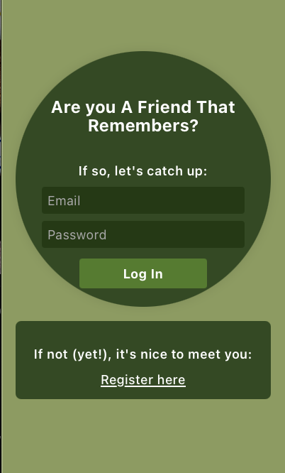

# A Friend That Remembers (AFTR) App

**In progress!**

  

  

This project is a personal side project that reminds users of important birthdays and provides a quick cache of relevant pictures of the person of honor for use in posts/stories. 

The app is made using a Python backend and React JS frontend.  

The final product will have the following functionality:
- Users register accounts with email/password
- Users add friends/family (will just refer to all as "friends" as umbrella moving forward) to database with a representative picture and birthday
- App checks database daily to pull any friends that have a birthday today
- If there is a friend with the birthday, app will parse user's photos (if given permission) to pull photos of the friend and remind user of friend's birthday with notifications.

Made using assistance from Generative AI. 
